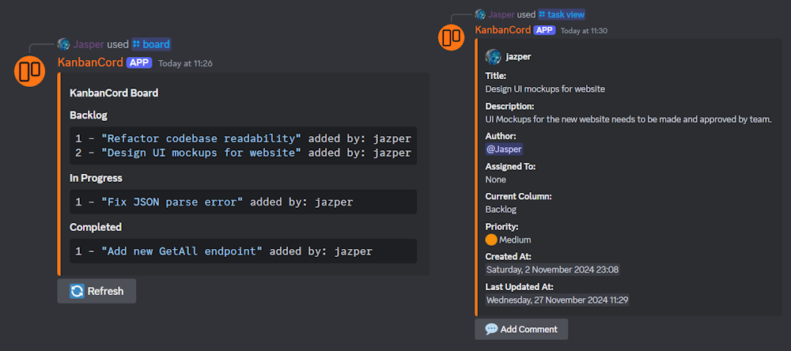

<p align="center">
  
</p>

<h1 align="center">KanbanCord</h1>

<p align="center">
  A simple Kanban board, but on Discord. The idea came from <a href="https://github.com/seansylee" target="_blank">seansylee</a> who made <a href="https://github.com/seansylee/kanban-board-bot" target="_blank">kanban-board-bot</a> which is no longer maintained.
</p>

[](https://github.com/j4asper/KanbanCord/actions/workflows/build-and-publish-docker-image.yml)

[](https://discord.com/oauth2/authorize?client_id=1301269207073165444)



## Table of Contents

<!-- TOC -->
  * [Setup](#setup)
    * [Docker](#docker)
      * [Image](#image)
      * [Variables](#variables)
      * [Database](#database)
    * [Docker Compose](#docker-compose)
    * [Build from source](#build-from-source)
<!-- TOC -->

## Setup

### Docker

#### Image

Docker image for KanbanCord is available on the docker hub here: https://hub.docker.com/r/jazper/kanbancord

#### Variables

These variables are Environment variables

| Variable                    | Description                                                             | Required | Default value |
|-----------------------------|-------------------------------------------------------------------------|----------|---------------|
| `TOKEN`                     | Your discord application token (bot token).                             | Yes      | None          |
| `MONGODB_CONNECTION_STRING` | MongoDB Connection String eg. `mongodb://localhost:27017`.              | Yes      | None          |
| `MONGODB_DATABASE_NAME`     | MongoDB Database Name, if you want to change it from the default value. | No       | `KanbanCord`  |
| `SUPPORT_INVITE`            | Support discord server invite link. Not needed when self hosting.       | No       | None          |


#### Database

A [MongoDB](https://www.mongodb.com/) is required for this bot to run. [A Docker image is available here](https://hub.docker.com/r/mongodb/mongodb-community-server).

KanbanCord will automatically create the required collections on startup, if they are missing.

| Collection Name |
|-----------------|
| Tasks           |
| Settings        |

### Docker Compose

A docker-compose file is available here: [docker-compose.yml](docker-compose.yml). This will setup the bot and a MongoDB database, the only thing you have to do, is to update the bot token.

### Build from source

You will need to clone the repository first:

```console
git clone https://github.com/j4asper/KanbanCord
```

Then you need to build the docker image, you need to be in the same directory as the [Dockerfile](Dockerfile):

```console
docker build -t kanbancord .
```

Now you can run the bot, and add the required environment variables:

```console
docker run -d -e TOKEN=your-bot-token -e MONGODB_CONNECTION_STRING=your-mongodb-connection-string kanbancord
```
